# Create A Custom Feed Aggregator From Multiple Sources .. In 20 Minutes

**Build a customized feed app with real-time updates from Reddit and The New York Times (or any other API) using Stream Feed, Zapier, and IFTTT.**

Have you ever wished you could gather all your feeds into a single app? I get tired of switching between Instagram, Facebook, and Reddit, so I created an app that combines two of my favorite feeds in one. 

Creating and maintaining a live feed of any kind poses serious demand on your development team. The infrastructure for such an application requires months of engineering and a high-level of technical expertise. Unless you're using Stream. 

This tutorial will demonstrate how fast and easy it is to build a custom feed app, using the [Stream Feed](https://getstream.io/activity-feeds/) infrastructure to do all the heavy lifting for us. We'll walk through the steps to initialize a Stream feed with a frontend and backend, and use [IFTTT](https://ifttt.com/) (If This Then That) and [Zapier](https://zapier.com/app/dashboard) webhooks to populate the feed in realtime with content from Reddit and the New York Times.

>### Stream
>*Build real-time feeds in less time. Leverage Stream's Feed API to build the most engaging activity feed without worrying about the underlying storage technology. Advanced features such as aggregation, ranking, real-time and personalization enable your product team to optimize your app’s engagement and retention.*
>- [Stream Chat & Messaging](https://getstream.io/activity-feeds/)

### Prerequisites

A basic knowledge of [React Hooks](https://reactjs.org/docs/hooks-intro.html) and [Express](https://expressjs.com/) will get you through this tutorial, but the concepts can easily be ported to any other frameworks and languages.

> [Git Project Repository](https://github.com/isaidspaghetti/stream-feedegator)

This tutorial focuses specifically on feed creation, and provides links for detailed instructions on more basic actions throughout.

Hint: if you want to build this app from scratch, we created ours by bootstrapping [getstream](https://www.npmjs.com/package/getstream), [create-react-feed](https://www.npmjs.com/package/react-activity-feed), [express-generator](https://www.npmjs.com/package/express-generator), & [create-react-app](https://www.npmjs.com/package/create-react-app). 

## 📖Outline

While Stream handles all the deep-work of this app, all we need to do is:

>* Configure a Stream app
>* Initialize a backend Stream Client
>* Create a backend app registration endpoint
>* Generate a user token
>* Declare a user feed
>* Follow feeds
>* Configure Zapier webhook
>* Configure IFTTT webhook
>* Create webhook endpoints that post to feeds

Let's get started!

## 🖋Frontend Registration Form

The first page a user will encounter in this app is the registration page. Which looks like this: 

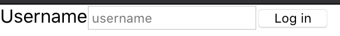

And is rendered by the following:

```jsx
//frontend/src/App.js:75
return (
    <div className="App container">
    <form className="card" onSubmit={register}>
        <label>Username</label>
        <input
        type="text"
        value={username}
        onChange={(e) => setUsername(e.target.value)}
        placeholder="username"
        required
        />
        <button type="submit">
        Log in
        </button>
    </form>
    </div>
);
 ```

When the `Log in\` button is clicked, the `register` function is executed:

 ```jsx
 //frontend/src.App.js:15
 const register = async (e) => {
    try {
      e.preventDefault();

      var response = await axios.post('http://localhost:8080/registration', {
        username: username
      });

      setStreamCredentials({ token: response.data.userToken, apiKey: response.data.streamApiKey });

    } catch (e) {
      console.error(e, e.error);
    }
};
```

The `register` function makes a simple `axios` post to the backend that includes the user's `username`. The `backend` will set up the Stream feed client, then send a `token` and an `apiKey` to initialize the app in the `frontend` (we'll see at how in a moment). These get stored in the state variable, `streamCredentials`, which determines what will be rendered in the app:

```jsx
//frontend/src/App.js:43
if (streamCredentials) {
    return (
      // Stream Feed Components
    );
  } else {
    return (
     // Registration Component
    );
  }
```

Note: obviously, one should secure their app with some authentication and authorization, but those topics are out of the scope of this post.

Before we can get to setting up the `backend` `registration` endpoint, we need to set up your Stream app.

## 🔨 Configure Your Stream App

First, in order to communicate with Stream, we need to get a Stream API key and secret. Grab your free Stream trial [here](https://getstream.io/), and see [this post](https://getstream.io/blog/send-chat-transcripts-to-hubspot/) for help with signing up.

Once you're signed up, create a Stream Feed app:

1. From the Stream [Dashboard](https://getstream.io/dashboard/), click the `Create App` button.

    

2. Choose any name for the app, and select `development` mode.

    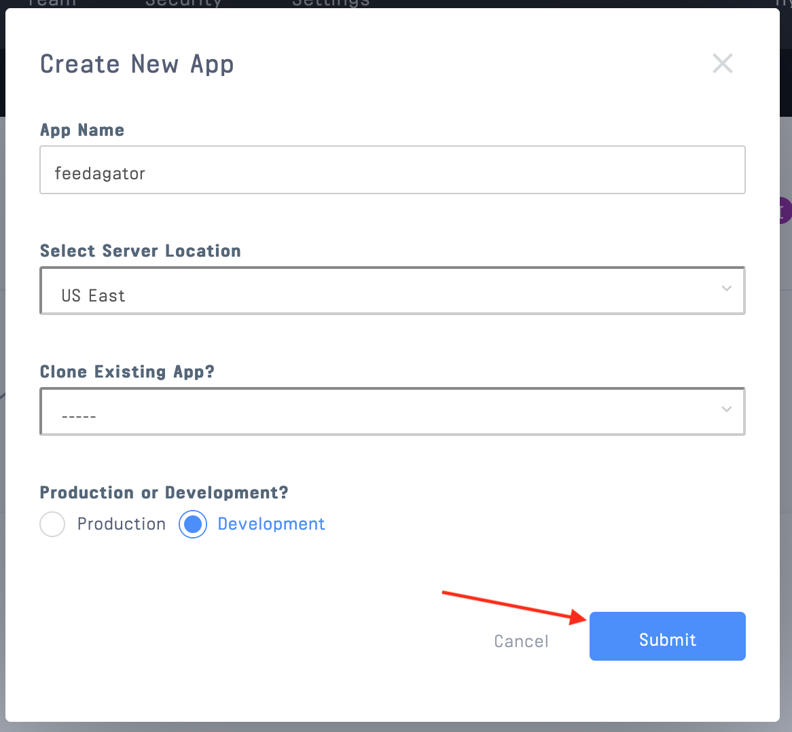

3. In the App Dashboard, add two new `feed groups` to your app. Name them `source` and `user`, and use the default `flat` group type.

    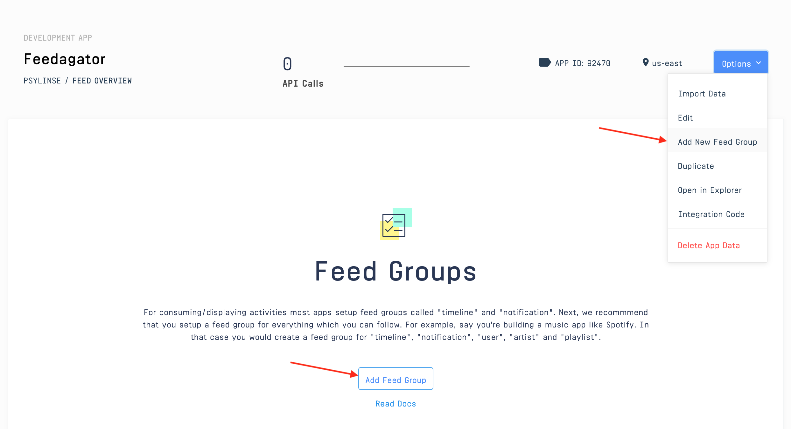 

    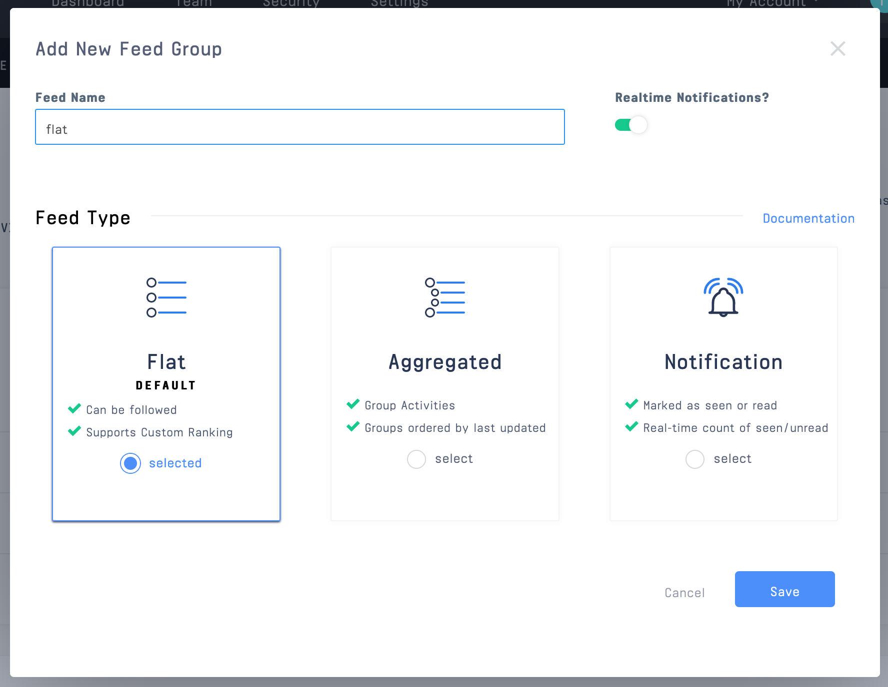

### 🤷🏻‍♀️Wait, what are **feed groups**? 
>* [Feed groups](https://getstream.io/docs/creating_feeds/?language=js) are a powerful Stream tool that you can use in any way your application would benefit. 
>* An app like Spotify might have one feed group for `users`, another for `artists`, and another for `playlists`. 

### 👍 Cool, so what's a **feed group *type***?
>* [Feed group *types*](https://getstream.io/docs/flat_feeds/?language=js) have different behavior settings. 
>* For instance, `Flat type` feed groups are the only feeds that can be followed.
>* Flat feeds can also be used to consume activities from other feeds - in a "timeline"-like manner.
>* Get creative with your `custom` feed groups to make your development process a breeze! 💥

Back to the Stream set-up...

4. This app uses a `dotenv` configuration. Copy the API key and API secret from the app dashboard and paste them into the file named `.env.example`. Change the filename to just `.env`

    ```bash
    //backend/.env
    NODE_ENV=development
    PORT=8080

    STREAM_API_KEY='your stream api key here'
    STREAM_API_SECRET='your stream secret here'
    ```

5. Finally, declare the environment variables for the API key and secret, and instantiate a new server-side Stream client:

    ```jsx
    //backend/routes/index.js:7
    const streamApiKey = process.env.STREAM_API_KEY;
    const streamApiSecret = process.env.STREAM_API_SECRET;

    const client = stream.connect(streamApiKey, streamApiSecret);
    ```
    Now we're ready to build the `backend` `registration` endpoint.

### 👨🏼‍🏫Good to know:
>Stream takes care of all of the complex feed infrastructure for us. Each time we use a `client` method, that's Stream doing its magic. 🧙‍♂️

## Backend Registration Endpoint

The `registration` endpoint performs the following:

1. Normalize the user input -- Stream usernames can include `a-z`, `A-Z`, and `0-9`

2. `createUserToken`

3. `getOrCreate` a Stream `user`

4. Initialize a `userFeed`

5. Follow the `reddit` and `nyt` (New York Times) users

6. Respond to the `frontend`

Here's the code for the tasks above:

```javaScript
//backend/src/index.js:13
router.post('/registration', async (req, res) => {
  try {
    const username = req.body.username.replace(/\s/g, '_').toLowerCase();

    const userToken = client.createUserToken(username);

    client.user("username").getOrCreate({ //CHECK ON THIS!!!!!!!!!!!!
      api_key: streamApiKey,
      name: "username",
    });

    const userFeed = await client.feed('user', username);

    await userFeed.follow('source', 'reddit');

    await userFeed.follow('source', 'nyt');

    res.status(200).json({
      userToken,
      streamApiKey,
      username
    });

  } catch (err) {
    console.error(err);
    res.status(500).json({ error: err.message });
  }
});
```

Consider the use of `'user'` and `'source'` feed groups above. This app uses the `'source'` feed group for content coming from reddit and NYT, and the `'user'` feed group for the user's `flat` feed. Distinguishing the two is not necessary for this app, but now you know how.

So, our `backend` is now letting the `frontend` know a `token` and `streamApiKey` so it can start the app; let's see how the feeds are displayed.

## Rendering Feeds

Stream has an entire library for React feeds called [`react-actvity-feed`](https://getstream.github.io/react-activity-feed/). It includes easy-to-use components with excellent built-in functionality. The next snippet is the heart of the `frontend`, and uses a few of these components to render our `user`'s `user` feed.

```html
//frontend/src/App.js:44
return (
  <div ref={containerRef}>
    <StreamApp apiKey={streamCredentials.apiKey} token={streamCredentials.token} appId='92470'>
      <div className="stream-app">
          <h3 className="app-title">Feedagator</h3>
          <button onClick={initializeFeeds}>One-time-Initialize</button>
      </div>
      <FlatFeed
      feedGroup="user" 
      options={{ limit: 20 }}
      Paginator={(props) => (
          <InfiniteScrollPaginator
          useWindow={false}
          threshold={10}
          {...props}
          getScrollParent={() => containerRef}
          />
      )}
      Activity={Activities}
      />
    </StreamApp>
  </div>
);
```

### < StreamApp />

The `< StreamApp />` [component](https://getstream.github.io/react-activity-feed/#streamapp)] is the primary wrapping component provided by Stream. It requires the `apiKey` and `token` we just created in the `backend` as props. It also needs an `appId`, which you can grab from your [Stream App Dashboard](https://getstream.io/dashboard/).

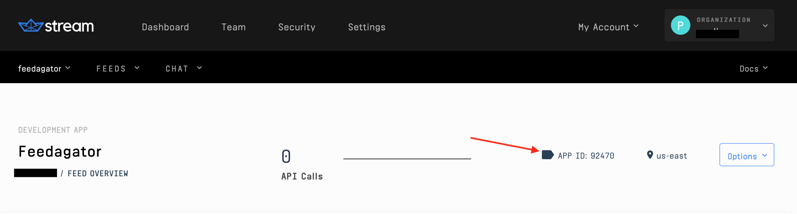

### 💁🏻‍♂️ Convenient Testing Button 

>If you don't want to wait for the feed to populate in real-time, this app includes a `one-time-initialize` button to grab the latest posts from our `sources`, and push them into their feeds. This is for testing and showcasing purposes only. We'll explain how that works later on.

### < FlatFeed />

The `< FlatFeed />` [component](https://getstream.github.io/react-activity-feed/#flatfeed) is another built-in from Stream. It accepts several optional arguments, and requires that we specify which `feedGroup` to display. 

We use the `'limit : 20'` property in the `options` prop to determine how many posts should get loaded at a time.

The `Paginator` prop handles scrolling functionality. In this app we utilize Stream's `< InfiniteScrollPaginator />` component, which gives our app a nice, modern scroll UX. 

[`Activities`](https://getstream.io/docs/adding_activities/?language=js) are the actual makeup of a feed. They can be videos, pictures, articles, or anything else a user might post. `< FlatFeed />` passes each `activity` to be rendered in the `user`'s feed to the `Activity` prop. The `Activity` prop determines *how* to render each `activity`. 

As you might have guessed, Stream has a built-in `< Activity />` component, but for this app we have a specific format in mind, so we'll create a custom component (`Activities`) instead. Before we dive into the `< Activities />` component, let's look at how those `activities` get created in Stream.

## Activities

For this app, we are focused on a single user consuming feeds that are automatically updated by our backend. Just keep in mind that Stream can let `frontend` users to create `activities` as well.


> ### 🚣🏽‍♂️ Create an Activity
>You only need two methods to create a Stream activity: `.feed()` and `.addActivity()`
*`.feed() accepts the feed group and the user
>* `.addActivity ()` accepts an object with 
>   * actor (required)
>   * verb (required)
>   * object (required)
>     * Foreign Id (recommended)
>     * Time (recommended)
>   * any custom properties


Learn more about the JSON spec for activities [here](https://activitystrea.ms/specs/json/1.0/).

So we know how our `activities` will get created, but how are we getting them?

## 🏗 Reddit - Zapier Webhook

To keep things simple, we're going to use a Zapier 'zap' (a webhook) to push reddit updates to our app. Let's set up a Zapier account and webhook.

### ⚡️ Build a Zapier Webhook

1. [Sign up](https://zapier.com/sign-up/?next=%2Fapp%2Fdashboard) for a free Zapier trial.

2. In the [Zapier Dashboard](https://zapier.com/app/onboarding?next=%2Fapp%2Fdashboard) click 'Make a Zap'

  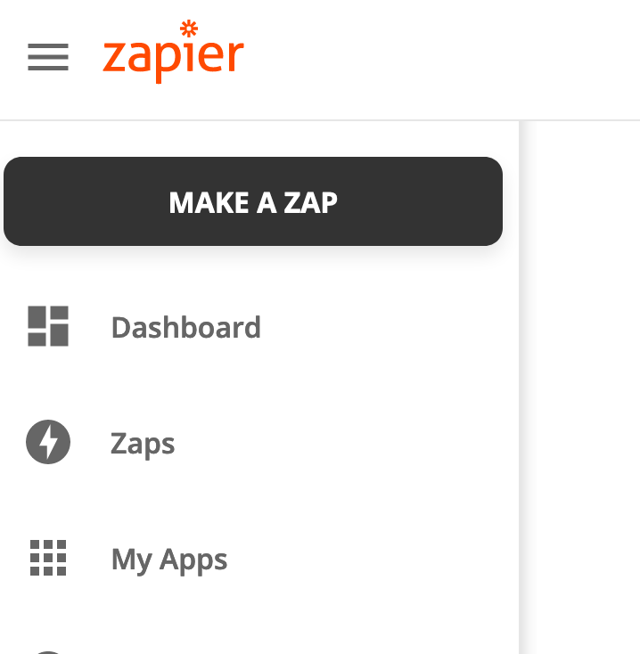

3. Search for and select 'reddit'

  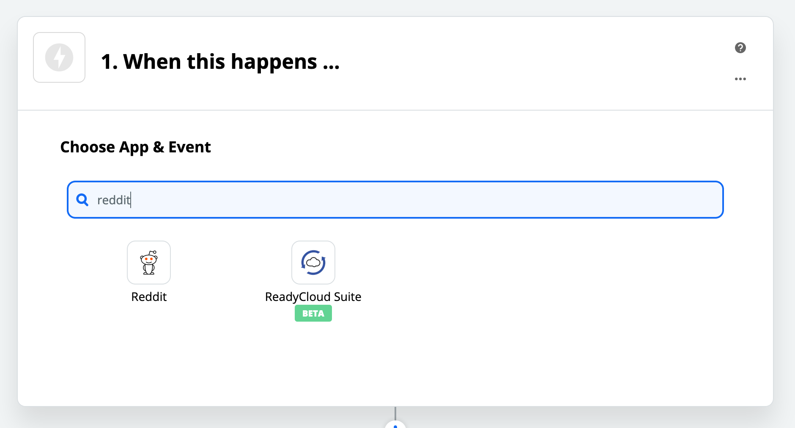

4. Select 'New Hot Post in Subreddit' for the triggering action

[](./images/hot-post.png)

5. Follow the prompts to sign in to your reddit account.

6. Choose a subreddit to receive webhooks for (we used `popular`), test the connection, and continue.

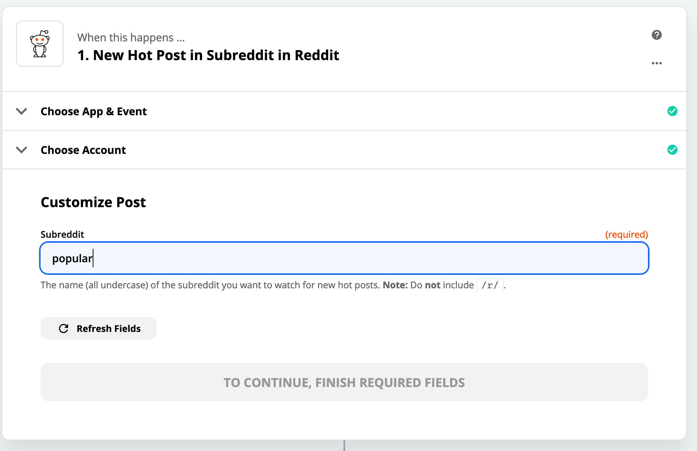

7. Search for and select `Webhooks by Zapier` in the 'Do This' section

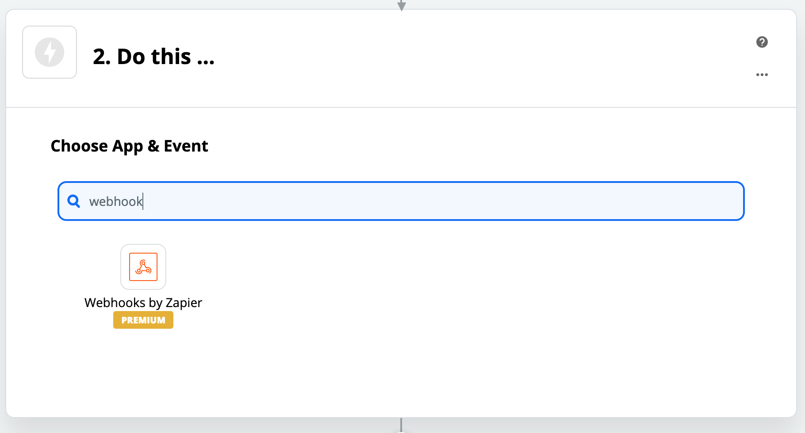

8. Select `POST` and continue. The next step requires a public URL. We're big fans of [`ngrok`](https://ngrok.com/docs)(free), so we used that to tunnel our backend server. (Learn how to use `ngrok` in [this post](https://getstream.io/blog/chat-transcripts-with-sendgrid/)). Enter your publically accessible URL followed by `/reddit-zapier-webhook` for the `Zapier` URL. Fill in the following fields as shown below. 

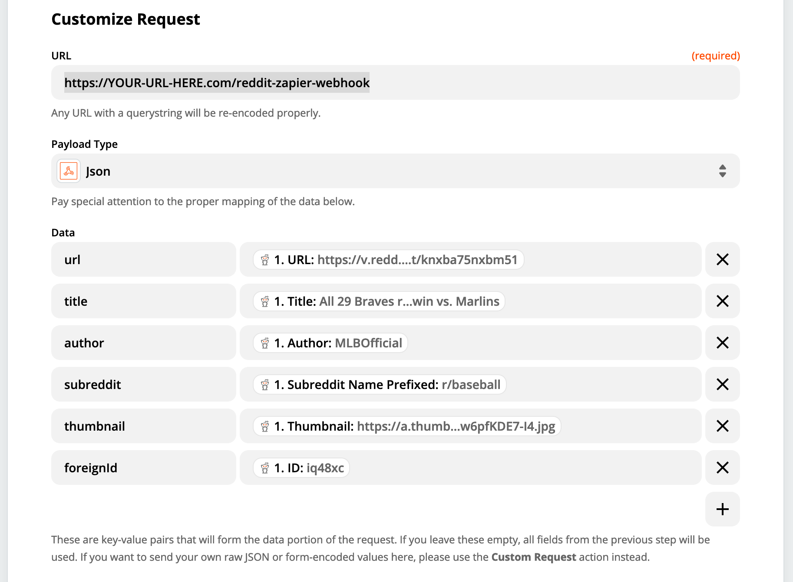

9. Noice! Add auth if you prefer (definitely do for development), and continue. 

Now, let's build a `backend` endpoint to receive the webhook.

### 🔚 Zapier Webhook Endpoint

Back in `backend` land, we have the following endpoint:

```javaScript
//backend/src/index.js:14
router.post('/reddit-zapier-webhook', async (req, res) => {
  try {
    const redditFeed = await client.feed('source', 'reddit');

    const post = await req;

    await redditFeed.addActivity({
      'actor': 'reddit',
      'verb': 'post',
      'object': post.body.url,
      'title': post.body.title,
      'author': post.body.author,
      'subreddit': post.body.subreddit,
      'thumbnail': post.body.thumbnail,
      'url': post.body.url,
      'foreignId': post.body.id,
    });

  } catch (error) {
    console.log(error);
    res.status(500).json({ error: err.message });
  }
  res.status(200);
});
```

This endpoint selects the `redditFeed` as the `client.feed`, await's the request `POST` from Zapier, and uses `.addActivity()` with custom fields matching the Zap json body we just created in Zapier.

🤙🏽 Sweet! Our app will now create a new activity for the `user` 'reddit' in their `'source'` feed! Now, let's use another tool to create an activity in the New York Times Feed.

## 📰 IFTTT - New York Times Webhook

### 👆👉Here's how to set up a webhook using IFTTT

1. [Sign up](https://ifttt.com/join/) for a free IFTTT account

2. In your dashboard, click the `create` button

  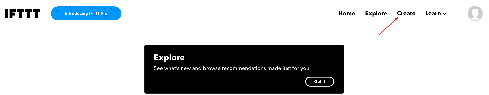

3. Click `Add` in the `IF` section

  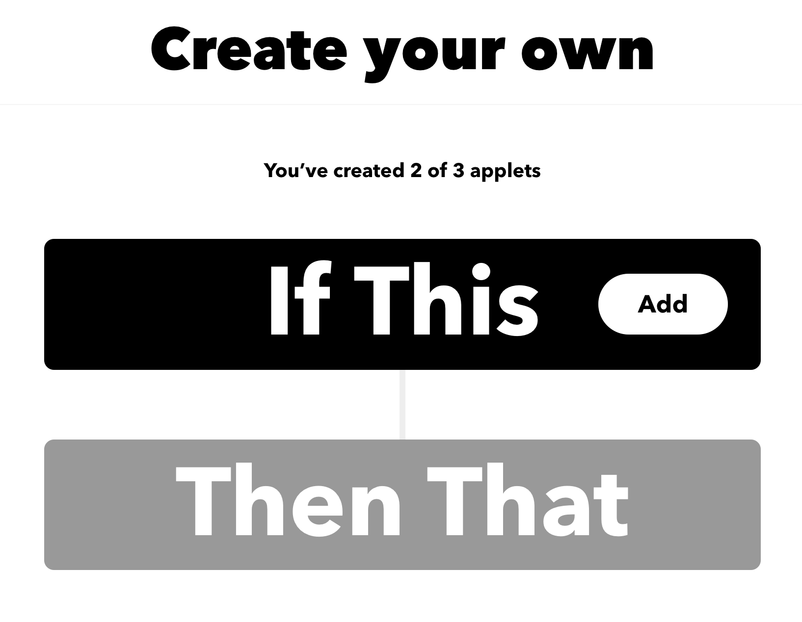

4. Search for and select `new york times`

  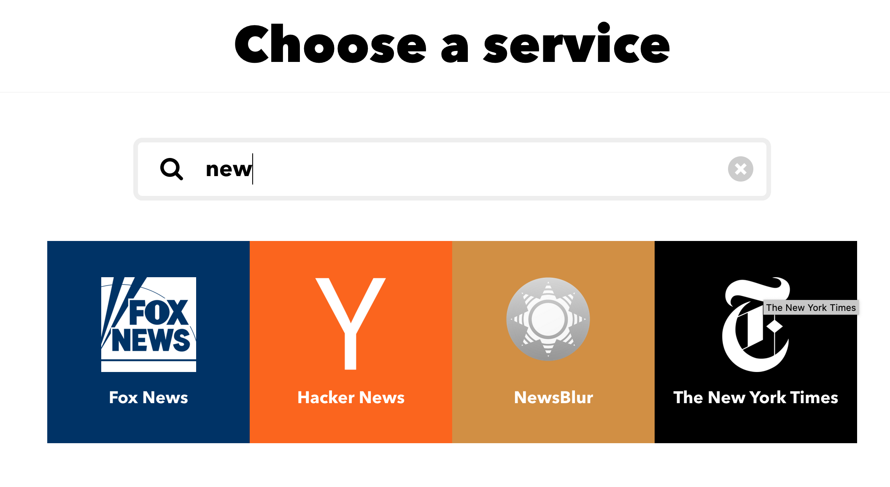

5. Select a triggering action. We used `New article in section` in this app

  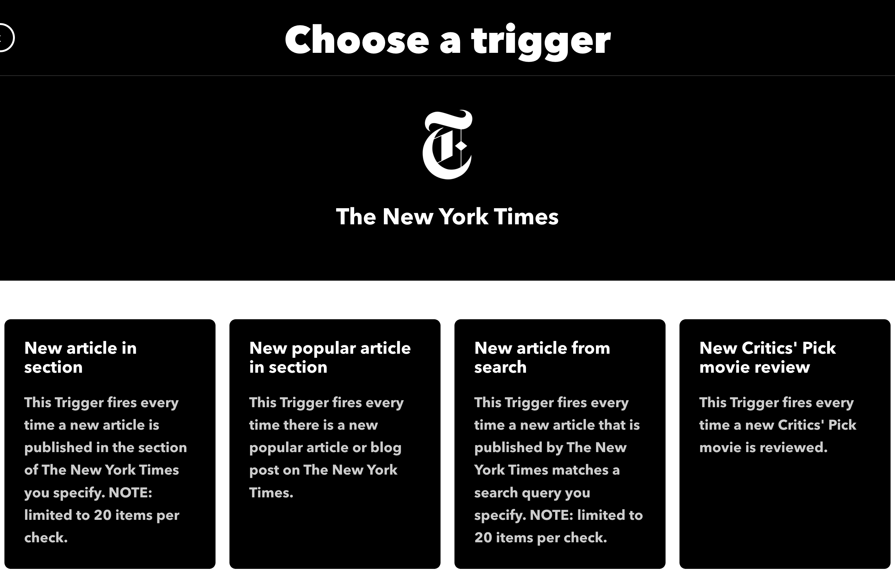

6. Select a section for the trigger

  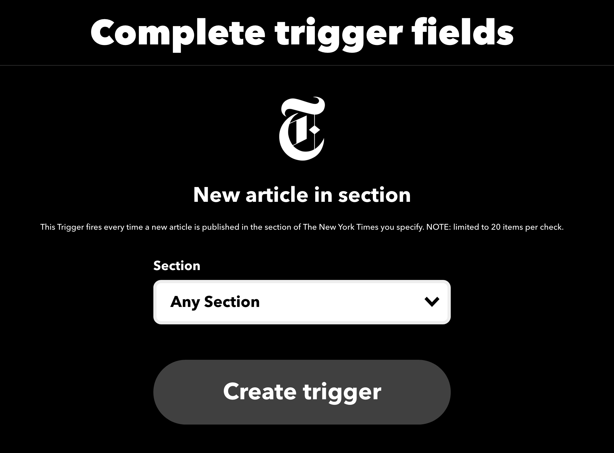

7. Continue to your `that`, search for and select `webhooks`, and `make a new 

  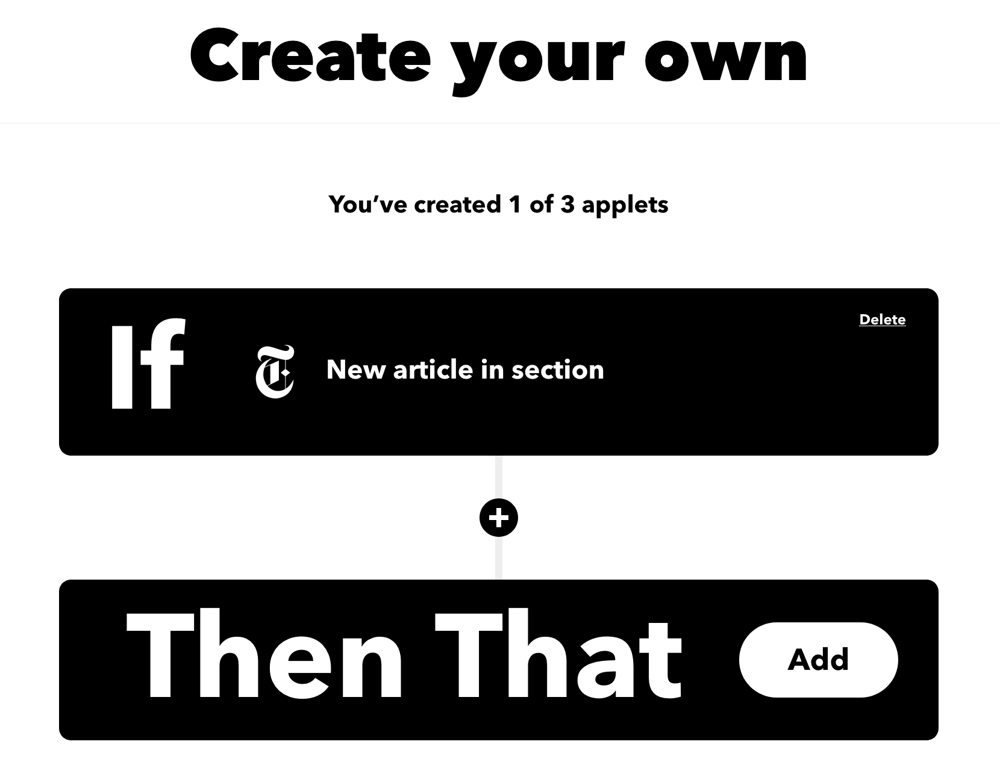

  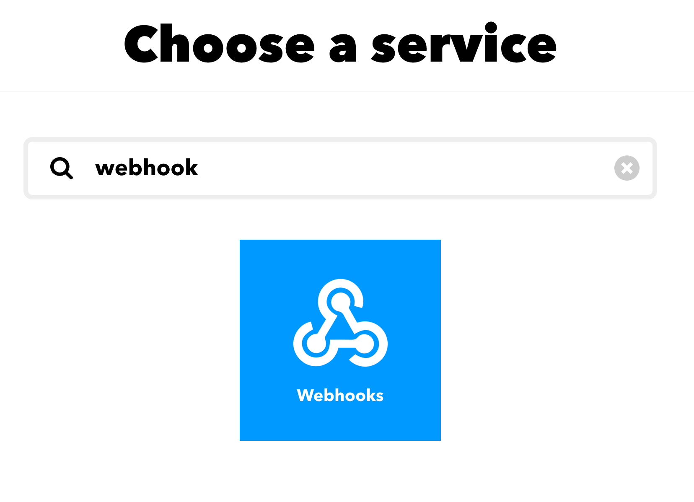

  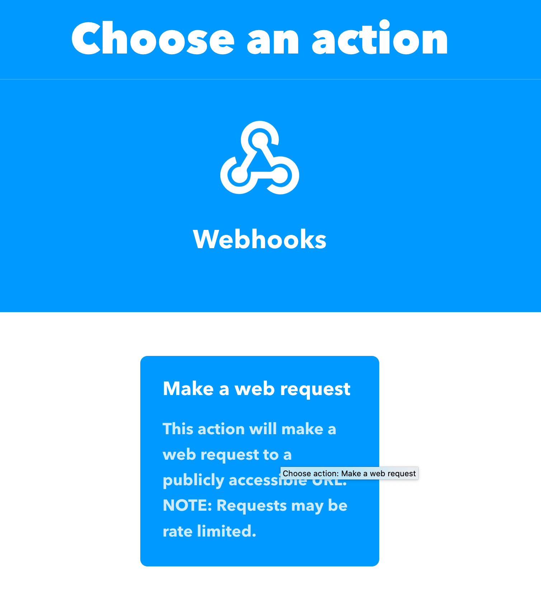

8. Fill in your settings as shown. Be sure to use `application/json` and `POST`.

  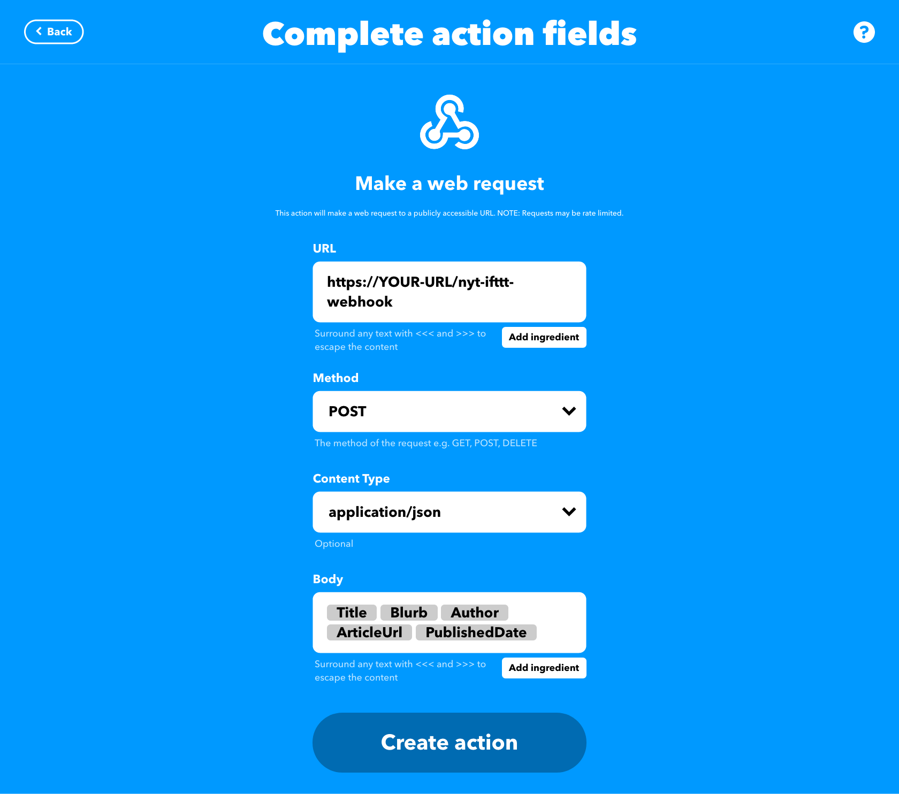

Done! Now let's look at the endpoint for this webhook.

### 🔚 IFTTT Webhook Endpoint

The IFTTT endpoint is essentially the same as the Zapier endpoint, with slightly different data fields selected.

```javaScript
//backend/src/index.js:112
router.post('/nyt-webhook', async (req, res) => {
  try {
    const nytFeed = await client.feed('source', 'nyt');

    await nytFeed.addActivity({
      'actor': 'nyt',
      'verb': 'article',
      'object': article.url,
      'title': article.title,
      'abstract': article.abstract,
      'date': article.published_date,
      'author': article.author,
      'section': article.section,
    });

  } catch (error) {
    console.log(error);
    res.status(500).json({ error: err.message });
  }
  res.status(200);
});
```

Awesome job! Stream will take care of pushing the feed updates to our frontend user, but let's look at that custom `< Activities />` everyone's been talking about. 

## Custom < Activities /> Component

The following component determines how the `source` feed activities are rendered. The `props` object below is passed in by `< FlatFeed />`. It contains all the properties of each feed `activity`. 

```html
//frontend/src/Activities.js:6
const Activities = ((props) => {
  if (props.activity.actor === 'reddit') {
    return (
      <div className='post'>
        
        
        <div className="post-content">
          <a className="post-title" href={props.activity.url}>{props.activity.title}</a>
          <p className="subreddit">Posted by {props.activity.author} in r/{props.activity.subreddit}</p>
        </div>
      </div >
    );
  }
  else if (props.activity.actor === 'bbc') {
    return (
      <div className='post'>
        
        <div className="post-content">
          <a className="post-title news-title" href={props.activity.object}>{props.activity.title}</a>
          <p className="abstract">{props.activity.abstract}</p>
          <p className="news-details">{props.activity.date}</p>
        </div>
      </div>
    );
  }
});
```

 The boolean using `props.activity.actor` determines which rendering style to use based on the `actor` property of each `activity`. The rest of this is just generic `jsx` using the properites of each `activity`. 

### 👏🏿 Well Done!

You've got a fully functional app! For extra credit, we'll now look at how to poll the reddit and New York Times APIs to quickly populate our feeds.

## ❓ Polling API's

What's this button do?

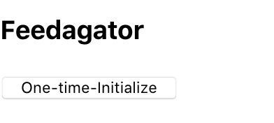

This button is just here for the demo app. It might take some time for our webhooks to build a significant source of content, so this button will trigger `backend` `http` `GET` requests to grab recent content from reddit and NYT. Here's how:

```javaScript
//backend/src/index.js:43
outer.post('/initialize', async (req, res) => {
  try {
    await client.user('reddit').getOrCreate({
      name: 'reddit'
    });

    const redditFeed = await client.feed('source', 'reddit');

    const redditUpdate = await axios.get('https://www.reddit.com/r/popular/top.json?count=3');

    const popularPosts = redditUpdate.data.data.children;

    popularPosts.forEach(async (post) => {
      await redditFeed.addActivity({
        'actor': 'reddit',
        'verb': 'post',
        'object': post.data.url,
        'subreddit': post.data.subreddit,
        'title': post.data.title,
        'thumbnail': post.data.thumbnail,
        'post_hint': post.data.post_hint,
        'preview': post.data.preview,
        'url': post.data.url,
        'foreignId': post.data.id,
        'resizedIcons': post.data.resized_icons,
        'author': post.data.author
      });

    });

    await client.user('nyt').getOrCreate({
      name: 'New York Times'
    });

    const nytFeed = await client.feed('source', 'nyt');

    const nytUpdate = await axios.get(`https://api.nytimes.com/svc/mostpopular/v2/viewed/1.json?api-key=${nytApiKey}`);

    nytUpdate.data.results.forEach(async (article) => {
      await nytFeed.addActivity({
        'actor': 'nyt',
        'verb': 'article',
        'object': article.url,
        'title': article.title,
        'abstract': article.abstract,
        'date': article.published_date,
        'author': article.author,
        'section': article.section,
      });
    });

    await client.user('npr').getOrCreate({
      name: 'npr'
    });

    res.status(200);

  } catch (err) {
    res.status(500).json({ error: err.message });
  }
});
```

This code initializes the `reddit` user and `redditFeed`. Then, it makes a simple `axios` request to the reddit API. The reddit API returns some of the top `popularPosts`. Then, we use a `forEach` to add each `popularPost` as an `activity` to the `redditFeed.

The same is done for the `nyt` feed, but this time, we have to include an API key for `nyt`. To get yours, go to [this site]( INSERT NYT API KEY PAGE), sign up for an account, then copy the API key from your dashboard.

//add imag here!

Add this key to your `.env` file:

```bash
//backend/.env
NYT_API_KEY='your-api-key-here'
```

And declare the key as a variable in `index.js`:

```javaScript
//backnd/src/index.js:9
const nytApiKey = process.env.NYT_API_KEY;
```

The rest of the snippet uses the same process as the `redditFeed` initialization. The Stream API stores all the uses, so you only need to use this button once. If you need to start fresh, you can delete your app data in the Stream Dashboard.

## Wrap Up

That's it! Stream makes it super easy to create powerful, customizable, and highly scalable feed apps. This app just skims the surface of Stream. They offer tons of other features including a [machine learning](ADD LINK) engine and consultative engineering team to help you build your feed's intelligence in meaningful ways. Parouse the [Stream Blogs](https://getstream.io/blog/) for more info, and have some fun building your next app!


## Create a Zapier RSS Poll 

To get updated on BBC News, we'll poll their RSS feed using Zapier. Here's how:

1. Like before, `Create a Zap` from the [Zapier Dashboard](https://zapier.com/app/onboarding?next=%2Fapp%2Fdashboard)

2. Search for and select `RSS by Zapier`

  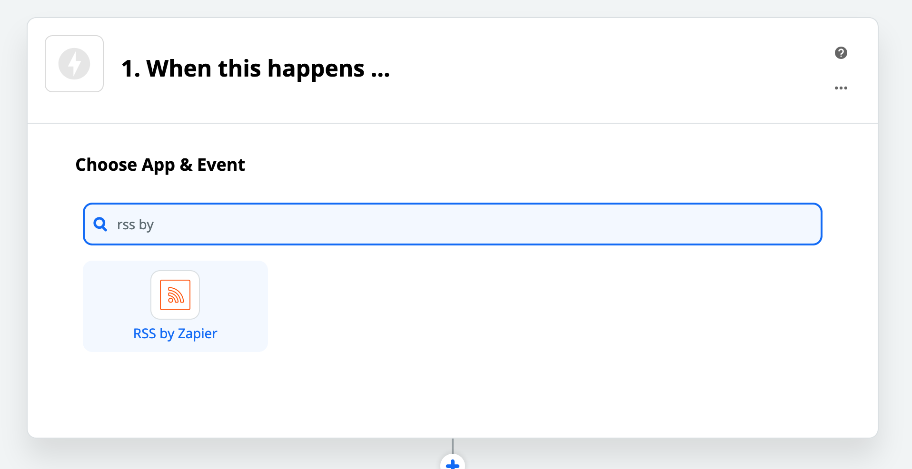

3. Trigger the Zap when BBC posts a `New item` in their feed

  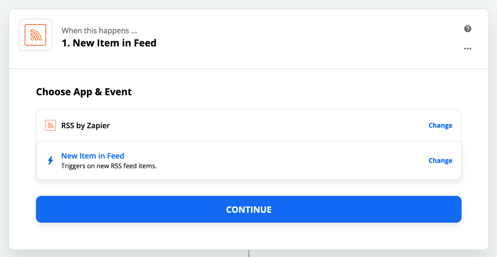

4. For the Zap action, select webhook again

  

5. Continue, and select `POST` as the method

  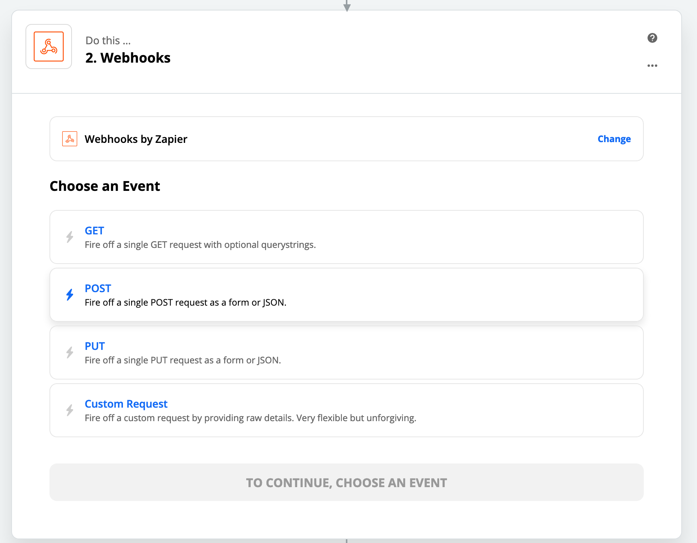

6. Enter BBC's RSS URL as shown below for the Webhook

  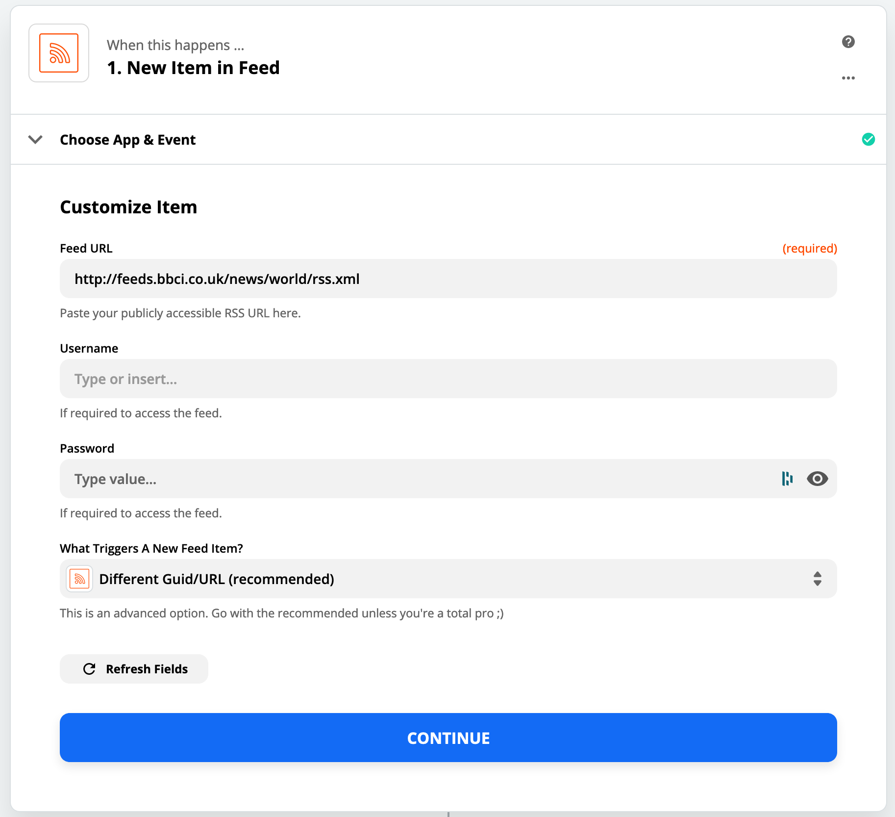

7. Use the `POST` settings as shown below, with your URL

  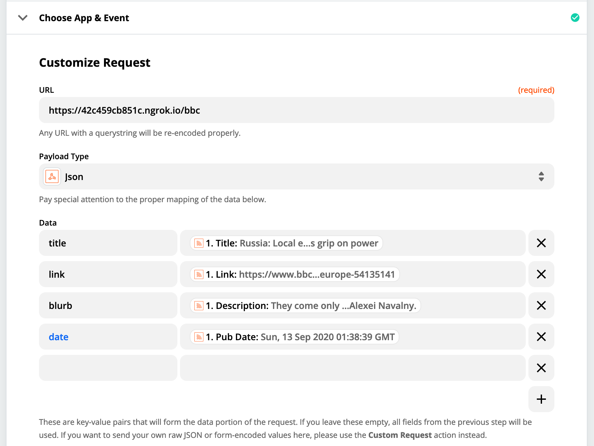

That's it! Test your webhook to be sure it's working properly.
